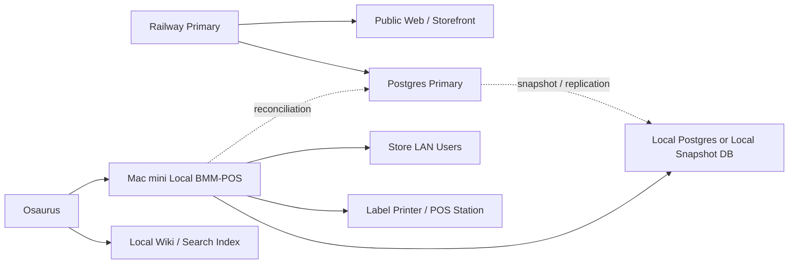

# BMM-POS Offline Resilience Plan — 2026-04-04

## Goal

Keep BMM-POS operational if internet access is degraded, blocked, or unavailable, while preserving the ability to resume normal cloud operation later without corrupting data.

This plan assumes:

- Railway remains the normal production host
- a Mac mini inside the store runs a local standby instance
- Osaurus is used for local knowledge search and optionally local AI support
- the store network remains available locally even if the public internet does not

## Design Principles

- Local POS must keep working on the LAN even if public internet is down
- Failover must be operationally simple for store staff
- Cloud-only features must fail clearly, not silently
- Local changes made during an outage must be tracked for later reconciliation
- Knowledge and SOP search must be available locally without internet

## What Must Work Offline

These are the functions worth engineering for local-first operation:

- staff login on the local network
- POS item lookup
- barcode scan / item add to cart
- manual item entry
- gift card balance lookups only if gift cards are fully local
- vendor lookup
- vendor balances
- rent history reference
- payout history reference
- label printing
- end-of-day reporting
- receipts and transaction lookup
- vendor item management for simple edits
- vendor dashboard basic reporting

## What Can Degrade Offline

These should be explicitly treated as degraded features, not hard requirements for failover:

- public storefront orders
- cloud email notifications
- external AI assistants
- third-party payment paths that require internet
- external image hosting if the CDN is unreachable
- any vendor/customer workflow that depends on live cloud callbacks

## Architecture Target

## Recommended Runtime Model

### Normal Mode

- Railway serves the live public app
- Mac mini continuously receives:
  - database snapshot or near-real-time replica
  - media mirror or image cache
  - local docs/wiki updates

### Outage Mode

- staff devices switch to local BMM-POS URL on the store LAN
- local app continues using the latest available local database state
- cloud-only features show explicit unavailable messaging
- all local writes are tagged as outage-window writes for later reconciliation

### Recovery Mode

- internet returns
- local outage-window writes are reviewed and synced upstream
- conflicts are resolved using defined rules
- store switches back to cloud primary

## Critical Constraint

The hard problem is not hosting the app locally. The hard problem is safe data reconciliation after local writes.

That means this plan should be built in phases:

1. local read-only resilience
2. local write capability for limited workflows
3. controlled reconciliation

Do not jump directly to full bidirectional sync without defining conflict rules.

## Phase Plan

## Phase 1: Stabilize and Recover the Repo

This is the current prerequisite.

- recover git from the local working tree
- restore a healthy GitHub repository
- reconstruct the missing Railway/Spaces/performance changes
- reapply label fixes

Output:
- stable codebase
- reliable deployment path

## Phase 2: Local Read-Only Resilience

Objective: let staff keep viewing essential data locally even if the internet fails.

### Build

- run BMM-POS on the Mac mini with a local reverse proxy
- maintain a local database copy:
  - nightly full snapshot at minimum
  - ideally periodic snapshot during open hours
- mirror item images locally
- add a health/status page showing:
  - cloud reachable or not
  - local DB snapshot age
  - local media sync age

### Offline-safe features

- vendor lookup
- item search
- sold item lookup
- vendor history
- rent and payout reference
- label generation
- SOP/wiki search

### Not yet allowed in this phase

- local writes that must sync back later

Output:
- staff can still answer questions and search records even if cloud is unreachable

## Phase 3: Local POS Write Mode

Objective: allow core register operation during an outage.

### Allowed writes

- sales
- receipts
- gift card transactions only if gift card state is local
- rent payments
- manual items if needed
- end-of-day reports

### Requirements

- every local write gets:
  - `origin = local_outage`
  - `origin_node = macmini-01`
  - `origin_timestamp`
  - stable client-generated id / reconciliation id
- no dependency on cloud services inside the transaction commit path

### Required product decisions

- card payments:
  - either not supported offline
  - or routed through a separate offline-capable terminal process outside BMM-POS
- online orders:
  - unavailable during outage
- email:
  - queued or skipped

Output:
- store can keep checking out cash and allowed local payment methods during internet loss

## Phase 4: Reconciliation

Objective: safely merge local outage activity back into primary cloud data.

### Required conflict rules

- sales:
  - append-only, keyed by reconciliation id
- inventory:
  - if the same item sold in both places during split-brain, decide precedence
- balances:
  - recompute from ledger where possible
- rent payments:
  - ledgered and idempotent
- gift cards:
  - highest risk if they can be used in both locations during split-brain

### Recommendation

Do not allow both cloud and local write mode simultaneously.

Use an explicit operational failover:
- when local mode is activated, store staff use local only
- when cloud returns, local writes sync back before normal cloud use resumes

That avoids true split-brain.

Output:
- conflict surface is much smaller
- reconciliation is operationally realistic

## Phase 5: Local Wiki and Search

Objective: give staff in-house search for SOPs, vendor procedures, emergency instructions, and common support questions without internet.

### Content sources

- employee operating guide
- cashier quick reference
- vendor operating guide
- printer troubleshooting
- rent / payout rules
- password reset SOP
- outage SOP
- emergency checkout SOP
- label setup and scanner troubleshooting
- vendor onboarding and booth split rules

### Storage model

- markdown files in repo under `docs/operations/`
- local synced docs directory on Mac mini
- PDFs optionally generated for printing

### Search model

- Osaurus indexes markdown/PDF content locally
- search UI available on LAN
- expose:
  - keyword search
  - category filters
  - “top SOPs” quick links

### Minimum viable taxonomy

- POS
- Rent
- Payouts
- Vendors
- Labels
- Passwords
- End of Day
- Offline Emergency

Output:
- staff can search internal guidance even during internet loss

## Recommended Mac Mini Setup

### Services on the Mac mini

- local BMM-POS app
- local PostgreSQL
- local media cache directory
- scheduled backup jobs
- local reverse proxy
- Osaurus wiki/search service

### Suggested network model

- reserve a static LAN IP
- local DNS alias or memorable hostname
  - e.g. `bmm-local.local`
- print a failover card for staff:
  - “If internet is down, go to `http://bmm-local.local`”

## Data Strategy Options

## Option A: Snapshot Restore

Simplest to implement.

- periodic snapshots from Railway Postgres to Mac mini
- local DB used only during outage
- manual or scripted sync-back afterward

Pros:
- simpler
- safer than active-active

Cons:
- local copy may be slightly stale when outage starts

## Option B: Continuous Replica

Harder but better local freshness.

- cloud DB replicated to local DB regularly
- still use one-way normal mode, local write mode only during declared outage

Pros:
- fresher local data

Cons:
- more moving parts
- still needs reconciliation tooling

Recommendation:
- start with Option A

## Immediate Engineering Backlog

After repo recovery, build in this order:

1. Recover and stabilize BMM-POS repo
2. Restore Railway/Nixpacks/migration/Spaces changes
3. Add a local environment profile for Mac mini deployment
4. Add a local startup script and health page
5. Add periodic DB export/import or snapshot pipeline
6. Add local image mirror strategy
7. Add outage-mode UI banner and feature gating
8. Add ledger origin metadata for local outage writes
9. Add reconciliation export/import tooling
10. Add local wiki/search content and Osaurus indexing

## Operational Playbooks To Write

- internet outage switch-over
- internet restored switch-back
- local printer fallback
- offline checkout rules
- offline rent payment rules
- offline gift card policy
- conflict review after outage

## Risks

- card payments may still fail without internet regardless of app resilience
- gift cards are high-risk if not fully local
- active-active dual-write is not recommended
- local write mode without reconciliation metadata will create accounting errors
- repo recovery must happen before any of this work is pushed safely

## Tonight / Next Steps

### Tonight

- recover repo from local working tree
- restore GitHub health
- reconstruct missing Railway/Spaces changes
- reapply label fix

### Next engineering session

- define the Mac mini local runtime
- choose snapshot vs replica strategy
- document offline feature matrix
- start local wiki/search setup

## Definition of Success

BMM-POS is considered offline-resilient when:

- staff can switch to a local URL on the store LAN
- local POS can sell core items and print labels/receipts
- vendor and rent/payout history is searchable locally
- SOP/wiki search works with no internet
- outage-window writes are tracked and reconciled back safely
- returning to normal cloud operation is a defined procedure, not guesswork
